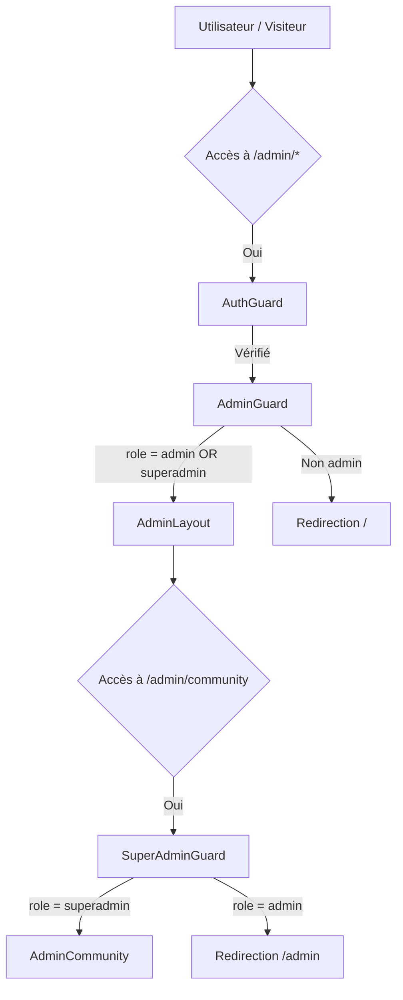

# Spécifications d'Administration : Routage, Rôles et Autorisations

Ce document décrit l'architecture du panneau d'administration, la distinction entre les rôles d'Administrateur et de SuperAdmin, ainsi que la configuration des routes et des barrières de sécurité (Guards).

---

## 1. Distinction des Rôles : Admin vs. SuperAdmin

L'application prend en charge deux niveaux de privilèges d'administration :

| Fonctionnalité / Accès | Administrateur (Admin) | SuperAdministrateur (SuperAdmin) |
| :--- | :---: | :---: |
| Rôle requis en base (`user_roles`) | `admin` | `superadmin` |
| Gestion du Dashboard personnel | **Oui** | **Oui** |
| Gestion de ses propres articles | **Oui** | **Oui** |
| Gestion de ses propres vidéos | **Oui** | **Oui** |
| Accès à la page Paramètres | **Oui** | **Oui** |
| Gestion communautaire (`/admin/community`) | **Non** (Verrouillé) | **Oui** (Accès complet) |
| Gestion et attribution des badges tiers | **Non** | **Oui** |
| Ban utilisateur | **Non** | **Oui** |
| Gestion des rôles | **Non** | **Oui** |

> [!NOTE]
> Le statut de SuperAdmin est déterminé par le hook [`useRole.ts`](src/hooks/useRole.ts) en vérifiant si `role === 'superadmin'` dans la table `user_roles`.

---

## 2. Structure des Guards de Sécurité

Les routes de l'application sont protégées par une hiérarchie de composants Guards dans [`routes.tsx`](src/app/routes.tsx) :

### AuthGuard
Vérifie que l'utilisateur est authentifié et non banni. Si ce n'est pas le cas :
- Non connecté → redirigé vers `/login`
- Banni (`is_banned=true`) → redirigé vers `/banned`

### AdminGuard
Vérifie que l'utilisateur connecté possède le rôle `admin` ou `superadmin` dans la table `user_roles`. Si l'utilisateur n'est pas admin, il est redirigé vers `/`.

### SuperAdminGuard
Utilisé spécifiquement pour envelopper les pages sensibles telles que `/admin/community`. Si l'administrateur connecté n'est pas superadmin (`role !== 'superadmin'`), le guard bloque le rendu et le redirige silencieusement vers `/admin`.

---

## 3. Sidebar Rôle-Aware (`AdminLayout`)

La barre latérale de navigation ([`AdminLayout.tsx`](src/pages/admin/AdminLayout.tsx)) s'adapte à l'état de l'utilisateur :
*   **En-tête Sobre** : Affiche un titre "Admin" constant avec le nom complet de l'utilisateur et son checkmark de vérification s'il est actif.
*   **Navigation Commune** : Accès direct aux pages Dashboard, Articles, Vidéos, Messages, Notifications et Paramètres.
*   **Section SuperAdmin Verrouillée** : Le lien "Community" n'apparaît que pour les superadmins.

---

## 4. Login et redirection

Après connexion (`/login`), l'utilisateur est redirigé vers `/`. Le composant `RootRedirect` gère ensuite la redirection vers `/:user` (profil public du tenant) ou `/admin` (si admin) selon le rôle.

Le profil public par défaut est `mopaossi`. Les utilisateurs anonymes voient `/mopaossi`.

---

## 5. Sécurité JWT

Les Cloudflare Functions (`functions/api/`) forwardnt le header `Authorization` du client à Supabase REST API pour l'application des politiques RLS. La clé anon (`SUPABASE_ANON_KEY`) est utilisée en fallback pour les requêtes non authentifiées. Les tokens ne sont jamais exposés côté client.
